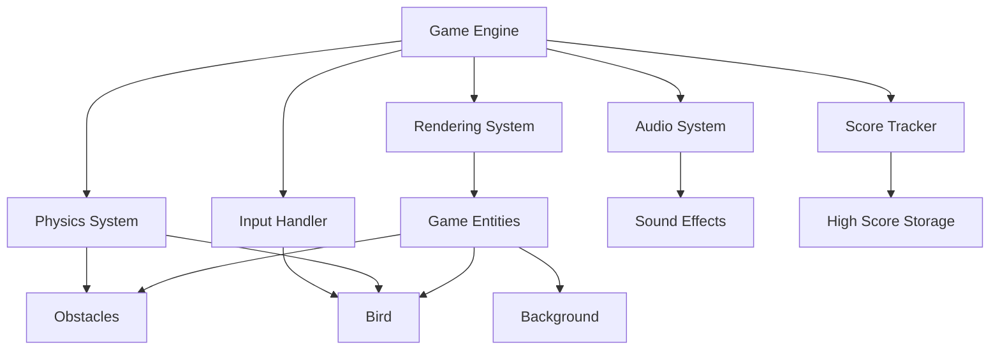

# BluePrint Example Project: Flappy Bird Clone

This document demonstrates a sample interaction between a programmer and an LLM using BluePrint to design and implement a Flappy Bird clone game.

## Initial Conversation

**User:** I want to build a simple flapping bird game, kind of like Flappy Bird. Let's use BluePrint to plan this out.

**LLM:** I'd be happy to help you plan a flapping bird game! To get started, could you share some basic requirements or ideas about what you want in the game?

**User:** I'm thinking of a simple 2D game where a bird flies through obstacles by flapping its wings when the player taps. I want it to run in a web browser, keep score, and have some simple graphics. Nothing too fancy, but fun to play.

**LLM:** Thanks for those details! Let's create a project design document to organize our thoughts. This will help us map out the components and structure of the game.

```
design project FlappyBirdClone
```

## Project Design Document

*LLM creates a project design document as a markdown artifact*

```markdown
# FlappyBirdClone - Project Design Document

## Overview
A browser-based 2D game inspired by Flappy Bird where players control a bird character navigating through obstacles by tapping/clicking to make the bird flap its wings. The game features simple graphics, score tracking, and increasing difficulty.

## Project Goals
- Create an engaging, easy-to-learn but challenging game
- Implement smooth, responsive controls
- Develop visually appealing but simple graphics
- Ensure the game runs well on both desktop and mobile browsers

## Core Features
- Bird character that responds to player input (mouse clicks/taps)
- Procedurally generated obstacles (pipes) to navigate through
- Physics-based movement (gravity, momentum)
- Collision detection and game over state
- Score tracking based on obstacles passed
- Difficulty progression (speed increases over time)
- Simple start/game over screens
- Sound effects for flapping, scoring, and collisions

## Technical Architecture



## Component Breakdown

### Core Systems
1. **Game Engine**
   - Game loop
   - State management (start, playing, game over)
   - Component coordination

2. **Physics System**
   - Gravity simulation
   - Collision detection
   - Object movement

3. **Rendering System**
   - Canvas drawing
   - Animation handling
   - Visual effects

4. **Input Handler**
   - Mouse/touch event detection
   - Input response timing

5. **Audio System**
   - Sound effect playback
   - Background music (optional)

### Game Entities
1. **Bird**
   - Properties: position, velocity, rotation
   - Behaviors: flap, fall, collide

2. **Obstacles (Pipes)**
   - Properties: position, gap size, width
   - Behaviors: move, spawn, check passage

3. **Background**
   - Parallax scrolling (optional)
   - Day/night cycle (optional)

4. **User Interface**
   - Score display
   - Start/game over screens
   - High score table

## Data Model

```blueprint
Entity Bird {
  properties: {
    x: float,            // X position
    y: float,            // Y position
    velocity: float,     // Vertical velocity
    rotation: float,     // Visual rotation
    width: float,        // Hitbox width
    height: float,       // Hitbox height
    alive: boolean       // Is bird alive
  },
  
  methods: {
    flap(),              // Apply upward force
    update(deltaTime),   // Update position based on physics
    render(context),     // Draw bird on canvas
    checkCollision(obstacles) // Check for collisions
  }
}

Entity Obstacle {
  properties: {
    x: float,            // X position
    topHeight: float,    // Height of top pipe
    gapSize: float,      // Size of passable gap
    width: float,        // Width of pipes
    passed: boolean      // Has bird passed this obstacle
  },
  
  methods: {
    update(deltaTime),   // Move obstacle leftward
    render(context),     // Draw obstacle on canvas
    checkPassed(bird),   // Check if bird passed obstacle
    checkCollision(bird) // Check if bird collided with obstacle
  }
}

System GameEngine {
  properties: {
    bird: Bird,
    obstacles: Obstacle[],
    score: int,
    gameState: string,   // "start", "playing", "gameOver"
    speed: float,        // Game scroll speed
    spawnTimer: float    // Time until next obstacle spawn
  },
  
  methods: {
    start(),             // Initialize game
    update(deltaTime),   // Update all game entities
    render(),            // Render all game entities
    handleInput(event),  // Process user input
    spawnObstacle(),     // Create new obstacle
    updateScore(),       // Increment score when passing obstacle
    checkGameOver(),     // Check for game over conditions
    reset()              // Reset game state
  }
}
```

## Technology Stack
- HTML5 Canvas for rendering
- JavaScript for game logic
- Local Storage for high scores
- CSS for UI styling

## Potential Extensions
- Different bird characters
- Day/night cycle
- Parallax scrolling backgrounds
- Power-ups
- Achievements
- Customizable difficulty
```

**User:** This looks good! Can you create a development plan for building this game step by step?

**LLM:** I'll create a development plan that breaks down the implementation into manageable phases:

```
plan development FlappyBirdClone
```

## Development Plan

*LLM creates a development plan as a markdown artifact*

```markdown
# FlappyBirdClone - Development Plan

## Overview
This document outlines the phased approach to developing the FlappyBirdClone game, breaking down the implementation into manageable steps with clear milestones.

## Phase 1: Core Engine Setup (Estimated: 2-3 days)

### Goals
- Establish the basic game structure
- Implement game loop
- Set up rendering canvas

### Tasks
1. **Project Setup**
   - Create HTML/CSS/JS files
   - Set up canvas element
   - Configure responsive layout

2. **Game Loop Implementation**
   - Create requestAnimationFrame loop
   - Implement delta time calculation
   - Add state management (start, playing, game over)

3. **Canvas Setup**
   - Initialize 2D context
   - Handle window resizing
   - Set up coordinate system

### Deliverables
- Working canvas with game loop
- Empty game screen with proper sizing
- Game state transitions (no visuals yet)

## Phase 2: Bird Mechanics (Estimated: 2-3 days)

### Goals
- Implement the player-controlled bird
- Add physics for gravity and flapping
- Create bird rendering

### Tasks
1. **Bird Entity**
   - Create Bird class with properties
   - Implement position and velocity handling
   - Add rotation based on movement

2. **Physics Implementation**
   - Add gravity effect
   - Implement flapping mechanics
   - Create boundary constraints

3. **Input Handling**
   - Add mouse click detection
   - Add touch support for mobile
   - Connect input to flap action

4. **Bird Rendering**
   - Create bird sprite
   - Implement animation for flapping
   - Add rotation visualization

### Deliverables
- Controllable bird character that responds to clicks/taps
- Bird affected by gravity
- Visually appealing bird with proper animation

## Phase 3: Obstacle System (Estimated: 3-4 days)

### Goals
- Implement obstacles (pipes)
- Add obstacle generation
- Create collision detection

### Tasks
1. **Obstacle Entity**
   - Create Obstacle class with properties
   - Implement obstacle movement
   - Add random gap generation

2. **Obstacle Management**
   - Create obstacle spawning system
   - Implement obstacle recycling for performance
   - Set up difficulty progression (speed/frequency)

3. **Collision System**
   - Implement hitbox-based collision detection
   - Add collision response
   - Connect collisions to game over state

4. **Obstacle Rendering**
   - Create pipe graphics
   - Implement efficient drawing

### Deliverables
- Moving obstacles with random heights
- Collision detection that triggers game over
- Visually consistent obstacle appearance

## Phase 4: Scoring and UI (Estimated: 2-3 days)

### Goals
- Implement score system
- Create UI elements
- Add game screens

### Tasks
1. **Scoring Logic**
   - Detect when bird passes obstacles
   - Implement score counter
   - Add high score tracking with localStorage

2. **UI Elements**
   - Create score display
   - Implement start screen
   - Add game over screen with restart option

3. **Visual Polish**
   - Add background
   - Implement simple parallax effect (optional)
   - Create visual feedback for scoring

### Deliverables
- Functional scoring system with high score tracking
- Complete UI with start and game over screens
- Visually polished game environment

## Phase 5: Audio and Final Polish (Estimated: 2-3 days)

### Goals
- Add sound effects
- Implement final visual polish
- Optimize performance

### Tasks
1. **Audio System**
   - Add flap sound effect
   - Implement scoring sound
   - Create collision/game over sound
   - Add background music (optional)

2. **Visual Effects**
   - Add simple particle effects for flapping
   - Implement screen shake on collision
   - Create smooth transitions between states

3. **Optimization**
   - Perform performance testing
   - Optimize rendering
   - Ensure smooth gameplay on mobile devices

4. **Testing**
   - Cross-browser testing
   - Mobile device testing
   - Bug fixing

### Deliverables
- Complete game with audio
- Smooth, polished user experience
- Optimized performance across devices

## Phase 6: Extensions (Optional, based on time)

### Potential Extensions
- Different bird characters
- Day/night cycle
- Additional obstacles
- Power-ups
- Achievements

## Total Estimated Development Time
- Core implementation (Phases 1-5): 9-16 days
- Optional extensions: Varies based on features chosen

## Dependencies and Resources

### Assets Needed
- Bird sprite (with animation frames)
- Pipe/obstacle graphics
- Background image(s)
- UI elements (buttons, panels)
- Sound effects (flap, score, collision)

### Technical Requirements
- Modern browser with HTML5 Canvas support
- JavaScript ES6+ compatibility
- Mobile touch event support
```

**User:** This looks great! Let's start implementing the first component. Can you help me create the bird entity?

**LLM:** I'd be happy to help implement the bird entity! Let's create it in BluePrint first, and then we can compile it to JavaScript:

```
Blueprint Bird {
  properties: {
    x: float = 50,            // X position (fixed)
    y: float = 150,           // Y position (changes with gravity/flapping)
    velocity: float = 0,      // Vertical velocity
    gravity: float = 0.5,     // Gravity force
    flapStrength: float = -8, // Upward force when flapping
    rotation: float = 0,      // Visual rotation
    width: float = 34,        // Hitbox width
    height: float = 24,       // Hitbox height
    alive: boolean = true     // Bird state
  },
  
  methods: {
    flap() {
      velocity = flapStrength
    },
    
    update(deltaTime) {
      // Apply gravity to velocity
      velocity += gravity
      
      // Update position based on velocity
      y += velocity
      
      // Update rotation based on velocity
      rotation = velocity * 3
      
      // Clamp rotation
      if (rotation > 70) rotation = 70
      if (rotation < -30) rotation = -30
    },
    
    render(context) {
      // Save current context state
      context.save()
      
      // Translate to bird position
      context.translate(x, y)
      
      // Rotate around center
      context.rotate(rotation * Math.PI / 180)
      
      // Draw bird centered at origin
      context.drawImage(
        birdImage,
        -width / 2,
        -height / 2,
        width,
        height
      )
      
      // Restore context
      context.restore()
    },
    
    checkCollision(obstacles) {
      // Ground collision
      if (y + height / 2 > canvas.height - 50) {
        return true
      }
      
      // Ceiling collision
      if (y - height / 2 < 0) {
        return true
      }
      
      // Obstacle collision (simplified)
      for (let obstacle of obstacles) {
        if (this.intersects(obstacle)) {
          return true
        }
      }
      
      return false
    },
    
    intersects(obstacle) {
      // Simple rectangular collision detection
      const birdLeft = x - width / 2
      const birdRight = x + width / 2
      const birdTop = y - height / 2
      const birdBottom = y + height / 2
      
      // Check collision with top pipe
      if (birdRight > obstacle.x && 
          birdLeft < obstacle.x + obstacle.width &&
          birdTop < obstacle.topHeight) {
        return true
      }
      
      // Check collision with bottom pipe
      if (birdRight > obstacle.x && 
          birdLeft < obstacle.x + obstacle.width &&
          birdBottom > obstacle.topHeight + obstacle.gapSize) {
        return true
      }
      
      return false
    }
  }
}
```

```
compile javascript Bird
```

## Bird Implementation

*LLM compiles the Bird blueprint to JavaScript*

```javascript
/**
 * Represents the player-controlled bird in the Flappy Bird clone game
 */
class Bird {
  /**
   * Create a new Bird instance
   * @param {Object} config - Optional configuration object
   */
  constructor(config = {}) {
    // Position properties
    this.x = config.x || 50;            // X position (fixed)
    this.y = config.y || 150;           // Y position (changes with gravity/flapping)
    
    // Physics properties
    this.velocity = config.velocity || 0;      // Vertical velocity
    this.gravity = config.gravity || 0.5;      // Gravity force
    this.flapStrength = config.flapStrength || -8; // Upward force when flapping
    
    // Visual properties
    this.rotation = config.rotation || 0;      // Visual rotation in degrees
    this.width = config.width || 34;           // Hitbox width
    this.height = config.height || 24;         // Hitbox height
    
    // State
    this.alive = true;
    
    // Animation properties
    this.frameIndex = 0;
    this.frameCount = 3; // Assuming 3 animation frames
    this.frameTimer = 0;
    this.frameInterval = 100; // ms between frame changes
    
    // Load bird image
    this.image = new Image();
    this.image.src = config.imageSrc || 'images/bird.png';
  }
  
  /**
   * Make the bird flap upward
   */
  flap() {
    this.velocity = this.flapStrength;
    // Play flap sound if available
    if (window.sounds && window.sounds.flap) {
      window.sounds.flap.play();
    }
  }
  
  /**
   * Update bird position and physics
   * @param {number} deltaTime - Time in ms since last update
   */
  update(deltaTime) {
    // Apply gravity to velocity
    this.velocity += this.gravity;
    
    // Update position based on velocity
    this.y += this.velocity;
    
    // Update rotation based on velocity
    this.rotation = this.velocity * 3;
    
    // Clamp rotation
    if (this.rotation > 70) this.rotation = 70;
    if (this.rotation < -30) this.rotation = -30;
    
    // Update animation frame
    this.frameTimer += deltaTime;
    if (this.frameTimer > this.frameInterval) {
      this.frameTimer = 0;
      this.frameIndex = (this.frameIndex + 1) % this.frameCount;
    }
  }
  
  /**
   * Render the bird on the canvas
   * @param {CanvasRenderingContext2D} context - The canvas rendering context
   */
  render(context) {
    // Save current context state
    context.save();
    
    // Translate to bird position
    context.translate(this.x, this.y);
    
    // Rotate around center
    context.rotate(this.rotation * Math.PI / 180);
    
    // Calculate the source rectangle for animation frame
    const frameWidth = this.image.width / this.frameCount;
    const sourceX = this.frameIndex * frameWidth;
    
    // Draw bird centered at origin
    context.drawImage(
      this.image,
      sourceX, 0, frameWidth, this.image.height,
      -this.width / 2, -this.height / 2, this.width, this.height
    );
    
    // For debugging, draw hitbox
    if (window.DEBUG) {
      context.strokeStyle = 'red';
      context.strokeRect(-this.width / 2, -this.height / 2, this.width, this.height);
    }
    
    // Restore context
    context.restore();
  }
  
  /**
   * Check if bird collides with obstacles or boundaries
   * @param {Array} obstacles - Array of obstacle objects
   * @returns {boolean} True if collision detected
   */
  checkCollision(obstacles, canvasHeight) {
    // Ground collision
    if (this.y + this.height / 2 > canvasHeight - 50) {
      return true;
    }
    
    // Ceiling collision
    if (this.y - this.height / 2 < 0) {
      return true;
    }
    
    // Obstacle collision
    for (let obstacle of obstacles) {
      if (this.intersects(obstacle)) {
        return true;
      }
    }
    
    return false;
  }
  
  /**
   * Check if bird intersects with a specific obstacle
   * @param {Object} obstacle - The obstacle to check
   * @returns {boolean} True if intersection detected
   */
  intersects(obstacle) {
    // Calculate bird boundaries
    const birdLeft = this.x - this.width / 2;
    const birdRight = this.x + this.width / 2;
    const birdTop = this.y - this.height / 2;
    const birdBottom = this.y + this.height / 2;
    
    // Check collision with top pipe
    if (birdRight > obstacle.x && 
        birdLeft < obstacle.x + obstacle.width &&
        birdTop < obstacle.topHeight) {
      return true;
    }
    
    // Check collision with bottom pipe
    if (birdRight > obstacle.x && 
        birdLeft < obstacle.x + obstacle.width &&
        birdBottom > obstacle.topHeight + obstacle.gapSize) {
      return true;
    }
    
    return false;
  }
  
  /**
   * Reset bird to initial state
   */
  reset() {
    this.y = 150;
    this.velocity = 0;
    this.rotation = 0;
    this.alive = true;
  }
}

/**
 * Unit tests for Bird class
 */
describe('Bird', () => {
  // Mock canvas and context
  const mockCanvas = { height: 400 };
  const mockContext = {
    save: jest.fn(),
    translate: jest.fn(),
    rotate: jest.fn(),
    drawImage: jest.fn(),
    restore: jest.fn(),
    strokeStyle: '',
    strokeRect: jest.fn()
  };
  
  let bird;
  
  beforeEach(() => {
    bird = new Bird();
    // Mock Image
    bird.image = { width: 102, height: 24 }; // 3 frames of 34x24
  });
  
  test('flap() sets velocity to flapStrength', () => {
    bird.velocity = 5;
    bird.flap();
    expect(bird.velocity).toBe(bird.flapStrength);
  });
  
  test('update() applies gravity to velocity', () => {
    bird.velocity = 0;
    bird.update(16);
    expect(bird.velocity).toBe(0.5);
    bird.update(16);
    expect(bird.velocity).toBe(1.0);
  });
  
  test('update() updates y position based on velocity', () => {
    bird.y = 100;
    bird.velocity = 2;
    bird.update(16);
    expect(bird.y).toBe(102);
  });
  
  test('render() applies proper transformations', () => {
    bird.render(mockContext);
    expect(mockContext.save).toHaveBeenCalled();
    expect(mockContext.translate).toHaveBeenCalledWith(50, 150);
    expect(mockContext.rotate).toHaveBeenCalled();
    expect(mockContext.drawImage).toHaveBeenCalled();
    expect(mockContext.restore).toHaveBeenCalled();
  });
  
  test('checkCollision() detects ground collision', () => {
    bird.y = mockCanvas.height - 10;
    expect(bird.checkCollision([], mockCanvas.height)).toBe(true);
  });
  
  test('checkCollision() detects ceiling collision', () => {
    bird.y = -10;
    expect(bird.checkCollision([], mockCanvas.height)).toBe(true);
  });
  
  test('intersects() detects collision with obstacles', () => {
    const obstacle = {
      x: 40,
      width: 30,
      topHeight: 100,
      gapSize: 100
    };
    
    // No collision
    bird.y = 150;
    expect(bird.intersects(obstacle)).toBe(false);
    
    // Collision with top pipe
    bird.y = 80;
    expect(bird.intersects(obstacle)).toBe(true);
    
    // Collision with bottom pipe
    bird.y = 220;
    expect(bird.intersects(obstacle)).toBe(true);
  });
  
  test('reset() returns bird to initial state', () => {
    bird.y = 300;
    bird.velocity = 10;
    bird.rotation = 45;
    bird.alive = false;
    
    bird.reset();
    
    expect(bird.y).toBe(150);
    expect(bird.velocity).toBe(0);
    expect(bird.rotation).toBe(0);
    expect(bird.alive).toBe(true);
  });
});

export default Bird;
```

**User:** Now let's create the obstacle system with pipes that the bird needs to navigate through.

**LLM:** Let's create the obstacle system for our game:

```
Blueprint Obstacle {
  properties: {
    x: float = 400,           // X position (starts off-screen)
    y: float = 0,             // Y position (fixed at top)
    width: float = 52,        // Width of obstacle
    topHeight: float = 0,     // Height of top pipe (calculated randomly)
    gapSize: float = 120,     // Size of gap between pipes
    speed: float = 2,         // Movement speed
    passed: boolean = false   // Whether bird has passed this obstacle
  },
  
  constructor(canvasHeight, minGapSize = 120, difficulty = 1) {
    // Calculate random gap height
    
    ... coding would continue ...
```

## Project Evolution

The development would continue following the phases outlined in the development plan:

1. Complete the Obstacle implementation
2. Create the Game Engine to coordinate entities
3. Add the scoring system
4. Implement the user interface elements
5. Add sound effects and visual polish
6. Test and optimize the game

Throughout this process, BluePrint would be used to:
- Design each component before implementation
- Generate test cases automatically
- Discuss implementation options
- Analyze potential performance issues
- Compile BluePrint code to JavaScript
- Iteratively improve the codebase

The collaborative workflow between the programmer and the LLM creates a structured approach to game development, allowing the programmer to focus on design decisions while the LLM handles implementation details and testing.
